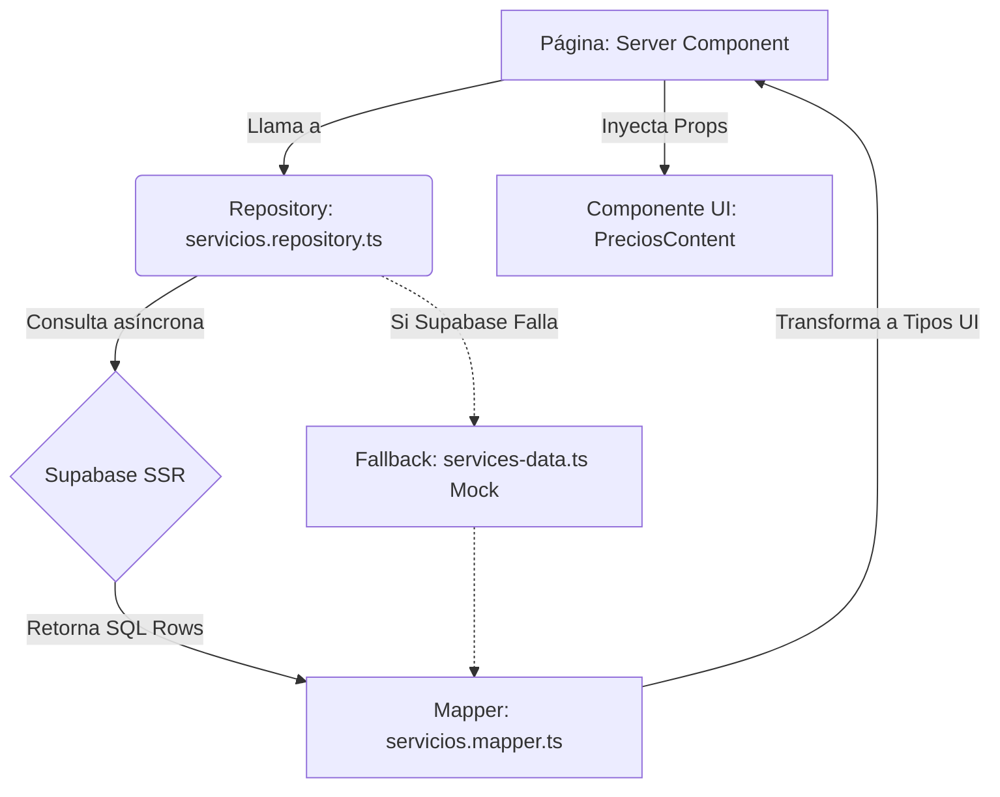

# Informe Técnico: Conexión SICOVE - Supabase

Este documento detalla la implementación técnica, arquitectura de carpetas y código exacto que se construyó para conectar el frontend (Next.js) de SICOVE con Supabase, manteniendo la integridad de los componentes visuales existentes.

---

## 1. Patrón Arquitectónico Implementado

Se implementó una arquitectura basada en **Repository Pattern** y **Data Mappers**. El objetivo es que los componentes de React de la UI nunca importen ni llamen a Supabase directamente, asegurando escalabilidad y protección a errores.



---

## 2. Estructura de Directorios Nueva (`apps/web`)

Se creó la siguiente infraestructura dentro del proyecto base:

*   **`lib/supabase/`**
    *   `server.ts`: Cliente de conexión principal. Extrae tokens/cookies de `@supabase/ssr`.
    *   `middleware.ts`: Archivo con lógica para la intercepción de rutas y refresco de tokens (Auth).
*   **`middleware.ts` (raíz de apps/web)**: Vincula el servidor global Next.js con Supabase para proteger directorios como `/admin`.
*   **`lib/actions/`**
    *   `contacto.ts`: Server Actions seguras invocadas por clientes para mutar/insertar datos directamente (ej: Contact Leads) en base de datos.
*   **`lib/repositories/`**
    *   `servicios.repository.ts`: Funciones asíncronas de servidor a servidor para consultar las tablas `categorias_servicio` y `planes`.
*   **`lib/mappers/`**
    *   `servicios.mapper.ts`: Convertidor de entidades desde SQL Crudo hacia Interfaces Front-End limpias.
*   **`types/database.types.ts`**: Esqueleto generador de las tablas principales que forzan al tipado de código.

---

## 3. Elementos Clave del Código

### A) El Cliente Server (SSR)
Ubicación: `apps/web/lib/supabase/server.ts`
Utiliza `cookies()` de Next.js (`next/headers`) para que el flujo de autenticación esté garantizado una vez se implementen usuarios RLS.

### B) El Fallback Tolerante a Fallos (Repository)
Ubicación: `apps/web/lib/repositories/servicios.repository.ts`

```typescript
export async function getServiciosComerciales() {
    try {
        const supabase = createClient()
        const { data: categorias, error } = await supabase.from('categorias_servicio').select('*')
        // Si hay error en Supabase o estamos en Vercel sin envs...
        if (error || !categorias) return SERVICIOS_COMERCIALES // Regresa mocks en memoria!
        
        // ... Mapeo y ordenación
    } catch(e) {
        return SERVICIOS_COMERCIALES // UI Blindada contra crasheos
    }
}
```
*Esto asegura que SICOVE seguirá renderizando la página de precios como la vez originalmente, incluso con la BD apagada o borrada.*

### C) El Transformador (Mapper)
Ubicación: `apps/web/lib/mappers/servicios.mapper.ts`
El esquema de PostgreSQL no puede albergar iconos ("Rocket", "Globe"), por ende, el Mapper los inyecta en vuelo combinando el slug de UI con las Rows de SQL.
Convierte `planDb.limites` (tipo JSONB) y lo formatea segun lo que los mapas de React piden (`features: string[]`, `es_recomendado: boolean`).

### D) Server Actions
Ubicación: `apps/web/lib/actions/contacto.ts`
Validación server-first. Incorpora la librería `zod` para verificar correos electrónicos limpios, strings correctas y envía directamente la orden `.insert` a la tabla de `consultas_contacto`. 

### E) Refactorización a "Force-Dynamic"
Los archivos `app/precios/page.tsx` y `app/servicios/page.tsx` pasaron a ser componentes servidos de forma asincrónica. Se incluyó el export `export const dynamic = 'force-dynamic'` para evitar que el motor SSG (Static Site Generation) de Next.js arroje errores `DYNAMIC_SERVER_USAGE` ya que `cookies()` aborta el renderizado en tiempo de "build".

---

## 4. Requisitos para la Actuación Real (To-Dos del Administrador)

En este punto la arquitectura está sembrada de forma invisible al usuario. Para que los datos fluyan de verdad se debe:
1. Renombrar / Copiar archivo `.env.local` con verdaderas `NEXT_PUBLIC_SUPABASE_URL` y variables de rol.
2. Asegurar que las tablas V3 (`init_schema.sql`) en efecto existan en ese proyecto en Supabase (Seeding).
3. Conectar el componente actual de UI del formulario de contacto y amarrarle la prop Action llamando a `submitContactLead(formData)`.
